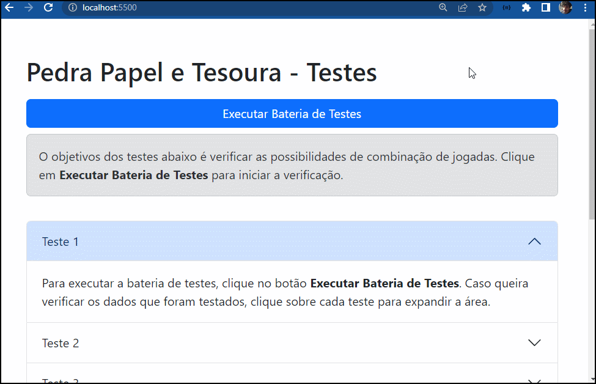

# Projeto: Pedra, Papel, Tesoura

  

## Introdução

Nesta atividade, desenvolvi a função `playRockPaperScissor` que simula o clássico jogo "Pedra, Papel, Tesoura". A função recebe as escolhas de dois jogadores como parâmetros e determina o vencedor ou se houve um empate, seguindo as regras do jogo.

## Descrição do Projeto

### Função `playRockPaperScissor`

A função recebe dois parâmetros: `player1` e `player2`, ambos são strings entre as possibilidades "Pedra", "Papel" e "Tesoura" (respeitando letras maiúsculas).

Dentro da função, as escolhas dos jogadores são verificadas para determinar o vencedor ou se há um empate, seguindo as seguintes regras:

- Pedra vence Tesoura.

- Tesoura vence Papel.

- Papel vence Pedra.

Ao final da simulação, a função retorna uma string indicando qual jogador venceu, como:

- "Jogador 1 venceu!"

- "Jogador 2 venceu!"

- "Empate!"
